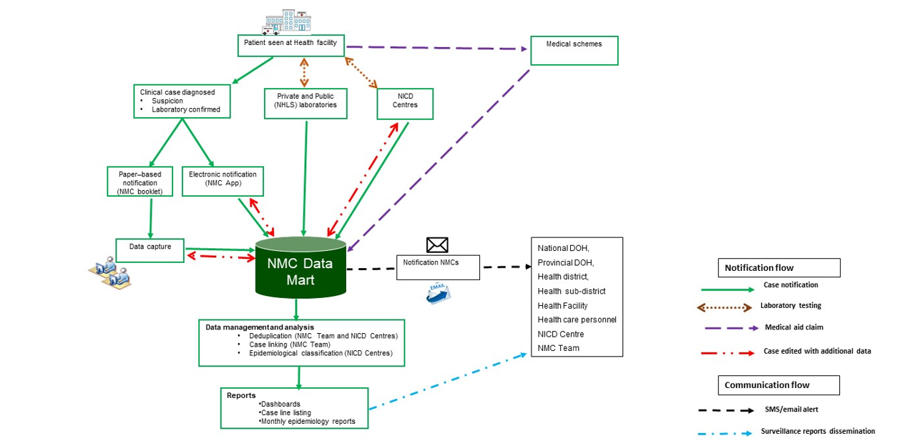

---
#html_document:
#  code_folding: hide
#  highlight: espresso
#  number_sections: yes
#  theme: journal
#  fig_caption: yes
#  fig_height: 3.5
#  fig_width: 4
#  self_contained: no
#date: ""
author: the National Institute for Communicable Diseases
output:
  bookdown::word_document2:
    pandoc_args:
    - "--filter=pandoc-crossref"
#   - "--reference-doc=Extras/June-report_working_reference.docx"
    - "--reference-doc=Extras/NMC_reference.docx"
    - "--lua-filter=extras/scholarly-metadata.lua"
    - "--lua-filter=extras/author-info-blocks.lua"
#   - "--variable=geometry:\"[portrait,landscape]\""
    fig_caption: true
    number_sections: true
    toc: false
    toc_depth: 2
    date:
      format: '%Y%m%d'
#    toc: yes

title: "NOTIFIABLE MEDICAL CONDITIONS SURVEILLANCE SYSTEM"
---


```{r setup, include =FALSE}

# make a function for the gtsummary and flextable settings.
#rm(list = ls())
#gc()

flextable::set_flextable_defaults(
  font.family = "Century Gothic", 
  font.size = 9, 
  header.font.size = 9,
  border.color = "black")


gtsummary::theme_gtsummary_language(language = "en",big.mark = " ", decimal.mark = ".")


knitr::opts_chunk$set(
  echo = FALSE, warning = FALSE, message = FALSE, out.width = "100%")

#libraries
library(tidyverse)
library(dplyr)
library(ggplot2)
library(knitr)
library(tinytex)
library(haven)
library(janitor)
library(summarytools)
library(lubridate)
library(grates)
library(forcats)
library(flextable)
library(magrittr)
library(gtsummary)


```

```{r load packages,message= FALSE, include= FALSE}


####
# set reporting date
####
reporting_date <- as_date("2023-09-01")

reporting_date_day_month_year  <- format( #this is to say that the date the data is from is one day before the report was
  as.Date(as_date(reporting_date), format = "%d%B%Y") - days(0)
  , "%d %B %Y")

reporting_date_month_year <- format( #this is to say that the date the data is from is one day before the report was
  as.Date(as_date(reporting_date), format = "%d%B%Y") - days(0)
  , "%B %Y")


reporting_date_month <- format( #this is to say that the date the data is from is one day before the report was
  as.Date(as_date(reporting_date), format = "%d%B%Y") - days(0)
  , "%B")

last_month_date <- as_month(Sys.Date()) - lubridate::month(1) # keep THIS

get_object_name_NMC<- function( ) {
# Step 1: Get last month's date
last_month_date <- Sys.Date() - lubridate::month(1)
last_month_year <- format(last_month_date, "%Y")
last_month_month <- format(last_month_date, "%m")

# Step 2: Create object name with the prefix "NMC_" followed by last month's date
object_name <- paste("NMC_", last_month_year, "_", last_month_month, sep = "")

return(object_name)
}

# change unkown in age categories
# change to prov_ in nmc categroies x2
# malaria map using proportions by district (notifications/all malria notifications)
# App use per district of malaria. (app / app+paper. (exclude lab))
```

```{r, include= FALSE}


as_paragraph("
             gtsmary style guide
             tbl_summary(
               label = var ~ )%>%
              modify_header(all_categorical ~ {label} n = {n},
                            label = (the characteristic)%>%
              modify_footnote(update = everything() ~ NA)
             
             "
             
             )

```

```{r,  include=FALSE, warnings = FALSE, message=FALSE}
library(readxl)
library(gtsummary)
library(flextable)
library(officer)
library(openxlsx)


#excel_load <- read_excel(paste0(object_name, ".xlsx"))
excel_load <- read_excel("line_list_export/Cases_Export_202310235_1.xlsx")#%>%filter(!Case_ID %in% "230812_4385687")


# run cleanign script
source("scripts_and_functions/NMC_merging.R")
excel_load1<- NMC_merge_cases(excel_load)


xtabs( ~case_type, data = excel_load1$final_full_fuzzy)

xtabs( ~case_type, data = excel_load1$final_full_exact)

excel_load1$final_full_fuzzy$notification_date

source("scripts_and_functions/stata_2_script.R")
library(tidyverse)
library(dplyr)
library(ggplot2)
library(knitr)
library(tinytex)
library(haven)
library(janitor)
library(summarytools)
library(lubridate)
library(grates)
library(forcats)
library(flextable)
library(magrittr)
library(gtsummary)


tibble_df<- excel_load1$final_full_fuzzy %>%as_tibble%>%select(- UID, uid)

tibble_df$notification_date

data_dup32<- stata2script(excel_load, verbose = T)
data_dup32<- stata2script(tibble_df, verbose = T)


data_dup32$notification_date 


# Now 'dates' contains the converted dates

#save as dataframes
#assign(get_object_name_NMC(), data_dup32)
#get_object_name_NMC()

#save(data_dup32, file = paste0(get_object_name_NMC(), ".rda"))
#write.xlsx(data_dup32, file = paste0(get_object_name_NMC(),".xlsx"), colNames = TRUE, append = FALSE)

#load(paste0(get_object_name_NMC(),".rda")) #load dup_data_32
xtabs(~ data_dup32$agecategory, addNA =T )
xtabs(~ data_dup32$gender, addNA= T)


data_dup32%>%names()

convertToDate(as.numeric(data_dup32$notification_date), origin = "1900-01-01")

data_dup32$condition %>%unique
data_dup32$notification_date

df<- data_dup32%>%mutate( 'reporting' = 1)%>%
  mutate( notification_date )%>%
  filter( as_month(as_date(notification_date)) %in% as_month(as_date(last_month_date)))%>%
  
  
  filter(!condition %in% "Leprosy")

df

df1<- df%>%filter(!Back_capture %in% "Back capture")

df1<- df1%>%mutate(prov_ = ifelse( case_id == "230911_44050491", "GP", prov_)) # just for september report. 


df2<- df%>%filter( Back_capture %in% "Back capture")
df2

write.xlsx(df, file = "line_list_export/september_NMC_cleaned.xlsx")
df
```

# Introduction {.unnumbered}

This report summarizes data from the National Notifiable Medical Conditions Surveillance System (NMCSS) on cases diagnosed and reported in **`r reporting_date_month_year`**. Additionally, this report includes information on the distribution of case notifications by sources, such as clinical or laboratory notifications, merged cases (**see Appendix no. 3**), and the number of reported deaths. It monitors the use of the electronic NMC Reporting Application (App) for notification, data quality, specifically the completeness and timeliness of clinical diagnosis and notifications over time, and back-captured cases notified in `r reporting_date_month_year` (**see Appendix nos. 1 and 3**). Category 4 NMCs, COVID-19, and multi-system inflammatory syndrome (MIS-C) have been excluded from this report.

## Highlights {.unnumbered}
```{r, include = FALSE}

# script for the tables you make that will be referenced in the in line chunks

tbl_notifications<- df1%>%select(nmccategories, time_to_notification) %>%
  tbl_summary(by= nmccategories, 
            label = list(time_to_notification ~ "Time to Notification"))%>%
  modify_footnote(update = everything() ~ NA)

cat1_notif_time<- tbl_notifications[["table_body"]][["stat_1"]][[1]]%>%as.character()

```
-   A total of `r nrow (df1)` cases were notified in `r reporting_date_month_year` and the majority were category 2 conditions.
-   There were x average active users of the NMC App in `r reporting_date_month_year`
-   Category 1 cases were reported in median (IQR) of `r cat1_notif_time` days.

## NMC Reporting application {.unnumbered}
-   [NMC Reporting App](www.nmc.nicd.ac.za) is available on both web and mobile platforms
-   Use recommended browsers in order to access NMC reporting App for notifications, searching of cases and reports.
-   Register if you have no NMC account and you can reset the password if you have not used the application over 12 months.
```{r, out.width='100%', fig.cap='', out.width = "100%"}

```
\newpage

# NMC data summary, `r reporting_date_month_year` {.unnumbered}

```{r, include=FALSE}

back_captured<-nrow(df%>%filter(Back_capture %in% c("Delayed", "Back Captured")))

table_summary <- tbl_summary(df1%>%select(case_type, nmccategories ),
                             by = case_type,
                             missing = "ifany",
                             label = list(nmccategories ~ "")
                             )%>% 
  modify_header(all_stat_cols() ~ "**{level}**, \n n = {n}",
                label = "**NMC Category**") %>%
  add_overall()  %>%
  modify_footnote( update = everything() ~ NA)


  # use `modify_footnote(everything() ~ NA, abbreviation = TRUE)` to delete abbrev. footnotes
  #modify_footnote(update = everything() ~ NA)
# Print the summary table
#table_summary1[["table_body"]][["label"]]<- c("NMC Category", "Category 1", "Category 2",  "Category 3", "Total")

# remove the first blank row for making into a flextable later. 
table_summary[["table_body"]][["label"]]<- c( "","Category 1", "Category 2",  "Category 3")
length<- table_summary[["table_body"]]%>%nrow()
table_summary[["table_body"]]<- table_summary[["table_body"]][2:length,]


cat1<-  table_summary[["table_body"]][["stat_0"]][grep("^category 1", table_summary[["table_body"]][["label"]], ignore.case = TRUE)]%>%as.character()

cat2<-  table_summary[["table_body"]][["stat_0"]][grep("^category 2", table_summary[["table_body"]][["label"]], ignore.case = TRUE)]%>%as.character()

cat3<-  table_summary[["table_body"]][["stat_0"]][grep("^category 3", table_summary[["table_body"]][["label"]], ignore.case = TRUE)]%>%as.character()

### Get into standard format for writing:

numbers <- gsub("\\D+", " ", cat2)
numbers
numbers <- strsplit(trimws(numbers), " ")[[1]]

# Format as "(n=7 906, 91%)"
output_text <- sprintf("(n=%s, %s%%)", paste(numbers[1], numbers[2]), numbers[3])

output_text
#sum(df$prov_ == "KZN" & df$'reporting' == 1, na.rm = T)


min_date<-format( min(as_date(df$diagnosis_date), na.rm = T), "%B, %Y") 

df2%>%arrange(diagnosis_date) %>%select(diagnosis_date)

#xtabs(~ Back_capture, data = df)%>%addmargins()

back_captured<- df2%>%filter( Back_capture %in% c("Back capture", "Delayed"))%>%select( prov_, condition) %>%
  tbl_summary(by = prov_,
              statistic = all_categorical() ~ "{n}",
              label = condition ~ "")%>%
    modify_header(all_stat_cols() ~ "**{level}**,\n n = {n}",
                  label = "**Condition**"
  )%>%
  modify_footnote( update =  everything() ~ NA)

back_captured_overall<- df2%>%filter( Back_capture %in% c("Back capture", "Delayed"))%>%select( condition) %>%
  tbl_summary(label = condition ~ "")%>%
    modify_header(all_stat_cols() ~ "**{level}**,\n n = {n}",
                  label = "**Condition**"
  )%>%
  modify_footnote( update =  everything() ~ NA)

tb_back_captured <-  back_captured_overall[["table_body"]][["stat_0"]][grep("^tuberculosis:p", back_captured_overall[["table_body"]][["label"]], ignore.case = TRUE)]%>%
  as.character()  %>%
  sub("* \\(", ", ",.)


```


```{r tbl, include = FALSE}
prov_tbl<- df1 %>%select(province) %>% 
  tbl_summary(
    statistic = list(province ~ "n={n}, {p}%")
  )


prov_tbl[["table_body"]] <- prov_tbl[["table_body"]] %>%
  mutate(
    n = as.numeric(gsub("[^0-9.]+", "", prov_tbl[["table_body"]][["stat_0"]])),
    n_percent = as.numeric(gsub("[^0-9.]+", "", gsub(".*\\((.*?)%\\).*", "\\1", prov_tbl[["table_body"]][["stat_0"]]))),
    n_text = gsub("[^a-zA-Z]+", "", gsub("n=[0-9.]+,\\s*\\((.*?)%\\)", "\\1", prov_tbl[["table_body"]][["stat_0"]])),
    na.rm = TRUE
  ) %>%
  arrange(-n)


prov_tbl
prov_tbl[["table_body"]]
prov_tbl[["table_body"]][["label"]][1]

most_common_prov <- paste0(prov_tbl[["table_body"]][["label"]][1]," (",  prov_tbl[["table_body"]][["stat_0"]][1],")")
sec_common_prov <-  paste0(prov_tbl[["table_body"]][["label"]][2]," (",  prov_tbl[["table_body"]][["stat_0"]][2],")")
thir_common_prov <- paste0(prov_tbl[["table_body"]][["label"]][3]," (",  prov_tbl[["table_body"]][["stat_0"]][3],")")

length_tbl<- nrow(prov_tbl[["table_body"]])

least_common_prov <-     paste0(prov_tbl[["table_body"]][["label"]][length_tbl-1]," (",  prov_tbl[["table_body"]][["stat_0"]][length_tbl-1],")")

sec_least_common_prov <- paste0(prov_tbl[["table_body"]][["label"]][length_tbl-2]," (",  prov_tbl[["table_body"]][["stat_0"]][length_tbl-2],")")

intro_blurb <- paste0(
"A total of n=", nrow(df)," cases were diagnosed and notified to the NMCSS in ", reporting_date_month_year," **(See Appendix no.3 for definitions)**. There were n=", nrow(df1)," current notifications; the majority ", output_text ,"were category 2 conditions . The provinces with the highest number of notifications were ", most_common_prov, ", ", sec_common_prov, ", and ", thir_common_prov,". The provinces with the least number of notifications were ", least_common_prov,", and ", sec_least_common_prov,". (**Figure 1**) There were n=", nrow(df2), " back captured clinical notifications diagnosed between ", min_date, " and ", reporting_date_month_year," and only notified in ", reporting_date_month_year, ". The majority (n=", tb_back_captured," of those notifications were cases TB:pulmonary notifications. (**See Appendix no.1**).")


#and n=", nrow(df2), " back captured notifications (**see Appendix no.3 for definitions**)
```

`r intro_blurb`

\vspace{3cm}


```{r tbl-cat-bycase, fig.cap ="" }

#tabel1<- xtabs(~nmccategories + case_source , data = df1)

#age_group_5_9 <- table1all[["table_body"]][["stat_0"]][grep("^5-9", table1all[["table_body"]][["label"]], ignore.case = TRUE)]

#knitr::kable(tabel1, "pipe", padding = 2, colnames = c("NMC categories", "Number of cases", "Proportion") ,
#  align = c("l", "c", "c"), caption = "Table 1: Description of NMC notifications by case source, ")

library(flextable)

# Add styling or formatting to the flextable if desired
table_flex <- table_summary %>%as_flex_table()%>%
  flextable::set_caption("Description of NMC notifications by case source") %>%# Example: making the first row (header) bold
    fontsize(, size = 9, part = "header")%>%
  flextable::set_table_properties(layout = "autofit", width = 0.99)

# Print the flextable

#### Take out superscript. (1)


#df_length<- nrow(table_flex[["body"]][["dataset"]])

#table_flex[["body"]][["dataset"]][1,1]<- NA

table_flex 
```

\newpage

## App use {.unnumbered}

```{r, echo=FALSE, fig.cap = "Distribution of notifications by province and notification type",  , warnings = FALSE, message=FALSE}

#df1$province %>%unique

plot <- df1%>%filter( !province == "UNKNOWN")%>%
  group_by(province, source_2)%>%summarise(count = n())%>%
  ggplot() +
  geom_bar(aes(x = reorder(province, -provinces), y = count,  fill = c("#ADE402", "darkolivegreen")),
           stat = "identity",
           position = "dodge",
           colour = "white") +
  geom_vline(xintercept = 450, colour = "red", linetype = 2, linewidth = 1) +
  coord_flip() +
  labs(#title = "Figure 1: Distribution of notifications by province and source",
       x = "Provinces",
       y = "Cases notified (N)",
       fill = "Notification Type") +
  theme_minimal()+
  theme(axis.text.x = element_text(margin = margin(t = 10)))+
  theme_classic()

library(forcats)

provinces<- df1 %>%
  filter(!province == "UNKNOWN") %>%
  group_by(province) %>%
  summarise(count = n()) %>%
  arrange(desc(count))%>%select(province) %>%as.list
  
plot <- df1 %>%
  filter(!province == "UNKNOWN") %>%
  group_by(province, source_2) %>%
  summarise(count = n()) %>%
  ggplot() +
  geom_bar(aes(x = reorder(province, count), y = count, fill = source_2),
           stat = "identity",
           position = "dodge",
           colour = "white") +
  scale_fill_manual( values =  c( "darkolivegreen", "#ADE402"))+
  geom_vline(xintercept = 450, colour = "red", linetype = 2, linewidth = 1) +
  coord_flip() +
  labs(x = "Provinces",
       y = "Cases notified (N)",
       fill = "Notification Type") +
  theme_minimal() +
  theme(axis.text.x = element_text(margin = margin(t = 10))) +
  theme_classic()
  
 ggsave(
    "plot.png",
    suppressWarnings(plot + theme(plot.background = element_rect(fill = "white", color = "black", linewidth = 0.5))),
    width = 7,
    height = 4,
    dpi = 1000
  )
  
   #Include the plot in the Quarto document
  knitr::include_graphics("plot.png")


```

```{r,  warnings = FALSE, message=FALSE, include = FALSE}
#names(df1)
tabl_sectorBysource <- df1%>%select(source_2, facility_sector) %>%tbl_summary(by = source_2)%>%add_overall
#tabl_sectorBysource
#tabl_sectorBysource[["table_body"]][["stat_1"]]
#tabl_sectorBysource[["table_body"]][["label"]]

private_clinical_notifications<-  tabl_sectorBysource[["table_body"]][["stat_1"]][grep("^private", tabl_sectorBysource[["table_body"]][["label"]], ignore.case = TRUE)]

all_clinical_notifications <- tabl_sectorBysource[["table_body"]][["stat_1"]][grep("*public*", tabl_sectorBysource[["table_body"]][["label"]], ignore.case = TRUE)]
tabl_sectorBysource

```

```{r}
capture_type_tbl <- df1%>%filter(case_source != "Lab") %>%select( prov_, capture_type2, ) %>%tbl_summary(missing = "ifany", 
                                                                                                         by = capture_type2)%>%
modify_header(all_stat_cols() ~ "**{level}**")

capture_sector_tbl<- df1%>%filter(case_type != "Lab") %>%select( prov_, facility_sector, ) %>%tbl_summary(missing = "ifany",
                                                                                                             by = facility_sector)%>%
modify_header(all_stat_cols() ~ "**{level}**")

practice1 <- tbl_merge(tbls= 
            list(capture_type_tbl, capture_sector_tbl), 
          tab_spanner = c("**Capture Type**", "**Sector**"))%>%
  as_flex_table%>%
    fontsize(, size = 9, part = "header")%>%
  flextable::set_table_properties(layout = "autofit", width = 0.99)


practice2<- tbl_strata2(df1%>%filter(capture_type2 != "Microstrategy/SDW") %>%select( prov_, capture_type2,facility_sector ),
                          strata = capture_type2,
           percent = "row",
                          .tbl_fun =
                            ~ .x %>%
        tbl_summary(by = facility_sector, missing = "no", percent = "row"
                    ) %>%
        add_n(),
        #.combine_with = "tbl_stack"
    #.header = "**{strata}**, N = {n}"
  )%>%
  as_flex_table%>%
  fontsize(., size = 9, part = "header")%>%
  flextable::set_table_properties(layout = "autofit", width = 0.99)


grouped<- df1%>%filter(capture_type2 != "Microstrategy/SDW") %>%select( prov_, capture_type2,facility_sector )%>%
  group_by(prov_, capture_type2,facility_sector )%>%
  summarise(count = n())


#df1$prov_%>%unique

#df1 %>%filter(is.na(prov_))

tbl<-df1%>%filter(capture_type2 != "Microstrategy/SDW") %>%select( prov_, capture_type2,facility_sector )%>%
  mutate( app_sector = case_when( capture_type2 == "App" & facility_sector == "Private" ~ "App - Private", 
                                  capture_type2 == "App" & facility_sector == "Public" ~ "App - Public",
                                  capture_type2 == "Paper-based" & facility_sector == "Private" ~ "Paper-based - Private",
                                  capture_type2 == "Paper-based" & facility_sector == "Public" ~ "Paper-based - Public"))%>%
  select(prov_, app_sector)%>%
  tbl_summary(by = app_sector, 
              percent = "row",
              label = list( prov_ ~ "")
              )%>%
      modify_header(all_stat_cols() ~ "**{level}**, \n n = {n}",
                label = "**Province**")%>%
  add_overall()%>%

  
  modify_footnote(update = everything() ~ NA)
  


length<- tbl[["table_body"]]%>%nrow()
tbl[["table_body"]]<- tbl[["table_body"]][2:length,]

tbl[["table_body"]]<- tbl[["table_body"]]%>% 
  mutate( n = 
            as.numeric(gsub( " ", "", gsub("\\(.*?\\)", "", tbl[["table_body"]][["stat_0"]])), na.rm= T))%>%
  arrange(-n)

#tbl[["table_body"]][["stat_0"]]

n_app_notifications <- sum(tbl[["df_by"]][["n"]][c(1, 2)])
perc_app_notifications <-  round((sum(tbl[["df_by"]][["n"]][c(1, 2)]))/(sum(tbl[["df_by"]][["n"]])) * 100 , 0)

# let us try and improve the tables and figures of this section. More general, better visuals and useful info. POtentially do circles of how differnt app utilisation eithe rfor national or by province. 
```
There were `r private_clinical_notifications` Clinical notifications from from the private sector (i.e. private hospitals, private practice and mining industry) compared to `r all_clinical_notifications` in the public sector. Clinical notifications using the NMC Reporting Application made up `r n_app_notifications` (`r perc_app_notifications`%) (see Table \@ref(tab:tab-notifications) ).

```{r}
#| include: false
# to adress mabores comment

df1%>%group_by(source_2, facility_sector)%>%
  summarise( count = n())

# totals
df1%>%group_by(source_2)%>%
  summarise( count = n())%>%
  ungroup() %>%
  mutate()

df1%>%select(nmccategories, source_2)%>%
tbl_summary(by = source_2, 
            percent = "row", 
            label = list(nmccategories ~ "") )%>%
  modify_header(label = "NMC Categories")%>%
  modify_footnote(update = everything() ~ NA)

```

\newpage

```{r  tab-notifications, warnings = FALSE, message=FALSE, fig.cap = ""}

# df3 <- subset(df1, df1$case_type!="Lab")

#tabel1<- xtabs(~province +  case_type, data = df3)
#tabel2<- xtabs(~province +  facility_sector, data = df3)


#Capsecttable <-cbind(tabel1,tabel2)
#knitr::kable(Capsecttable, align = "ccccc",caption = "**Table 2: Clinical notifications notified by provinces by Capture type and sector, **" )

# Apply font style and font size to flextable

#### this table needs to be capture_type ( app vs paper based )


### change the case_source to case_soruce2 which combines, andorid, Ios, 

tbl%>%
  as_flex_table%>%
  fontsize(., size = 9, part = "header")%>%
  flextable::set_table_properties(layout = "autofit", width = 0.99)%>%
  flextable::set_caption("Clinical notifications notified by provinces, reporting platform, and sector")


tbl_cross<- df1%>%filter(capture_type2 != "Microstrategy/SDW") %>%select( prov_, capture_type2,facility_sector )%>%
  mutate( app_sector = case_when( capture_type2 == "App" & facility_sector == "Private" ~ "App - Private", 
                                  capture_type2 == "App" & facility_sector == "Public" ~ "App - Public",
                                  capture_type2 == "Paper-based" & facility_sector == "Private" ~ "Paper-based - Private",
                                  capture_type2 == "Paper-based" & facility_sector == "Public" ~ "Paper-based - Public"))%>%
  select(prov_, app_sector)%>%
  tbl_cross(row = prov_, 
            col = app_sector, 
            percent = "cell", 
            label = list(prov_~"", app_sector~"Reporting Platform"))%>%
  bold_labels()%>%
   as_flex_table%>%
  fontsize(., size = 9, part = "header")%>%
  flextable::set_table_properties(layout = "autofit", width = 0.99)%>%
  flextable::set_caption("Clinical notifications notified by provinces, reporting platform, and sector")%>%
  compose(., i=1, j=1, value = as_paragraph("Province"))

```

\newpage

```{r, warnings = FALSE, message=FALSE, fig.cap ="", include = FALSE}

df_tbl <- df1 


tbl0 <- df_tbl  %>%select(agecategory)%>%tbl_summary(missing = "ifany",
                                                   label = list(agecategory~""),
                                                   statistic = all_categorical() ~ "{n}")  %>%
  modify_header(all_stat_cols() ~ "**{level}**")%>%
  modify_footnote(update = everything() ~ NA)

tbl0_total <- df_tbl %>%
  mutate(Total = 1)%>%
  select(Total)%>%
  tbl_summary(missing = "ifany", 
              #by = gender,
              statistic = all_categorical() ~ "{n}",
              #label = list(Total~"")
              )%>%
  modify_header(all_stat_cols() ~ "**{level}**")%>%
  modify_footnote(update = everything() ~ NA)


tbl_full_0 <- tbl_stack(tbls =list(tbl0, tbl0_total ))

# TABLE 1
tbl1 <- df_tbl %>%select(agecategory, gender)%>%
  tbl_summary(
    missing = "ifany", 
    by = gender,
    statistic = all_categorical() ~ "{n}",
    label = list(agecategory~""))%>%
  modify_header(all_stat_cols() ~ "**{level}**")%>%
  modify_footnote(update = everything() ~ NA)

tbl1_total <- df_tbl %>%select(gender)%>%
  mutate(Total = 1)%>%
  tbl_summary(missing = "ifany", 
              by = gender,
              statistic = all_categorical() ~ "{n}",
              #label = list(Total~"")
              )%>%
  modify_header(all_stat_cols() ~ "**{level}**")%>%
  modify_footnote(update = everything() ~ NA)


tbl_full_1 <- tbl_stack(tbls =list(tbl1, tbl1_total ))
# TABLE 2

tbl2 <- df_tbl %>%select(agecategory, patient_admission_status)%>%
  tbl_summary(missing = "ifany", 
              by = patient_admission_status,
              statistic = all_categorical() ~ "{n}",
              label = list(agecategory~""))%>%
  modify_header(all_stat_cols() ~ "**{level}**")  %>%
  modify_footnote(update = everything() ~ NA)


tbl2_total <- df_tbl %>%select(patient_admission_status)%>%
  mutate(Total = 1)%>%
  tbl_summary(missing = "ifany", 
              by = patient_admission_status,
              statistic = all_categorical() ~ "{n}",
              #label = list(Total~"")
              )%>%
  modify_header(all_stat_cols() ~ "**{level}**")%>%
  modify_footnote(update = everything() ~ NA)


tbl_full_2 <- tbl_stack(tbls =list(tbl2, tbl2_total ))

# TABLE 3
tbl3 <- df_tbl %>%select(agecategory, patient_vital_status)%>%
  tbl_summary(missing = "ifany", 
              by = patient_vital_status,
              statistic = all_categorical() ~ "{n}",
              label = list(agecategory~""))%>%
  modify_header(all_stat_cols() ~ "**{level}**")%>%
  modify_footnote(update = everything() ~ NA)

tbl3_total <- df_tbl %>%select(patient_vital_status)%>%
  mutate(Total = 1)%>%
  tbl_summary(missing = "ifany", 
              by = patient_vital_status,
              statistic = all_categorical() ~ "{n}",
              #label = list(Total~"")
              )%>%
  modify_header(all_stat_cols() ~ "**{level}**")%>%
  modify_footnote(update = everything() ~ NA)


tbl_full_3 <- tbl_stack(tbls =list(tbl3, tbl3_total ))

# Merged
tbl_merge <- tbl_merge(tbls = 
            list(tbl_full_1, tbl_full_2, tbl_full_3,tbl_full_0), 
          tab_spanner = c( "**Gender**", "**Admission Status**", "**Vital Status**", ""))%>%
  modify_header(label = "**Age Category**")


length<- tbl_merge[["table_body"]]%>%nrow()
tbl_merge[["table_body"]]<- tbl_merge[["table_body"]][2:length,]

tbl_merge%>%
  as_flex_table()%>%
  fontsize(, size = 9, part = "header")%>%
  flextable::set_table_properties(layout = "autofit", 
                                  width = 1)%>%
  flextable::set_caption("Age distribution by gender, admission status, and patient outcome") %>%
  bold(, j = 12)%>%
  bold(, i = length-1)

```

```{r blurbing}
#| include:false


#df1%>%
#  tbl_cross(row = agecategory, 
#            col = gender,
#            margin = "row",
#            missing = "ifany", 
#            percent = "cell")
##### Add last column as proportions of age groups. 

#knitr::kable(finaltable, align = "ccccc",caption = "**Table 3: Age distribution by gender, admission status, and patient outcome, **" )


# Create an automatic blurb ------


          desc_tbl <- df1 %>% select(agecategory, gender, patient_admission_status,patient_vital_status ) %>%tbl_summary

          #numbers <- desc_tbl[["table_body"]][["stat_0"]][2:15]
          
          numbers<- as.numeric(gsub( " ", "", gsub("\\(.*?\\)", "", desc_tbl[["table_body"]][["stat_0"]][2:15])), na.rm= T)
          
          male_perc<- desc_tbl[["table_body"]][["stat_0"]][grep(
            "^male", desc_tbl[["table_body"]][["label"]], ignore.case = TRUE)]
          
          female_perc<-  desc_tbl[["table_body"]][["stat_0"]][grep(
            "^female", desc_tbl[["table_body"]][["label"]], ignore.case = TRUE)]
          
          
          max_age_cat_n <-  desc_tbl[["table_body"]][["stat_0"]][grep(as.character(max(numbers, na.rm = T)), gsub( " ", "", gsub("\\(.*?\\)", "",desc_tbl[["table_body"]][["stat_0"]])))]
          
          max_age_name <- desc_tbl[["table_body"]][["label"]][grep(as.character(max(numbers, na.rm = T)), gsub( " ", "", gsub("\\(.*?\\)", "",desc_tbl[["table_body"]][["stat_0"]])))]
          
          n_hospitalised <- desc_tbl[["table_body"]][["stat_0"]][grep(
            "^inpatient", desc_tbl[["table_body"]][["label"]], ignore.case = TRUE)]
    
          n_transferred <- desc_tbl[["table_body"]][["stat_0"]][grep(
            "^transferred", desc_tbl[["table_body"]][["label"]], ignore.case = TRUE)]
    
          n_deaths <- desc_tbl[["table_body"]][["stat_0"]][grep(
            "^deceased", desc_tbl[["table_body"]][["label"]], ignore.case = TRUE)]
    

    if (male_perc > female_perc) {
      proportion <- male_perc
      gender <- "Males"
      gender_single <- "male"
    } else {
      proportion <- female_perc
      gender <- "Females"
      gender_single <- "female"
    }
    

    #sub(" .*", "", n_deaths)
    #sub(".*\\(", "", n_deaths) %>% sub("\\)", "",.)
    
blurb <- paste0("The majority of the notified cases were ", gender ," n(%) ", male_perc, ". Individuals in the ",max_age_name," year age group represented the majority (", max_age_cat_n,") of notified cases  (Table 3). At the time of notificaiton, approximately ", n_hospitalised, " of the notified cases were hospitalized, while ", n_transferred," were transferred to another healthcare facility. There were ", sub(" .*", "", n_deaths), " deaths notified during the reporting period with case fatality rate of ", sub(".*\\(", "", n_deaths) %>% sub("\\)", "",.),".")


```

`r blurb`

\newpage

## Hospital Form Completeness {.unnumbered}

```{r  , warnings = FALSE, message=FALSE, fig.cap = ""}
#df1$HFcomplete%>%unique
#df1$patient_admission_status%>%unique

hf_tbl<- df1 %>% 
    filter(!patient_admission_status %in% c("Outpatient", NA, "Unknown") & 
         nmccategories == 1)%>%
  
  select(HFcomplete, patient_admission_status, condition)%>%

  tbl_strata(., 
             strata = patient_admission_status,
             .tbl_fun = 
               ~ .x %>%
               tbl_summary(by = HFcomplete
                           )%>%
               modify_header(label = "**Hospital Form Completed**"
                             )%>%
               modify_header(all_stat_cols() ~ "**{level}**, n = {n} ({style_percent(p)}%)")
             )%>%
               modify_footnote(update = everything() ~ NA)

# need to get the "charactersitci" to change 
length<- hf_tbl[["table_body"]]%>%nrow()
hf_tbl[["table_body"]]<- hf_tbl[["table_body"]][2:length,]

hf_tbl%>%
  as_flex_table()%>%
  fontsize(, size = 9, part = "header")%>%
  flextable::set_table_properties(layout = "autofit", width = 1)%>%
  flextable::set_caption("Completion of hospitalisation form for patients diagnosed with category 1 conditions who were either admitted, discharged, or transferred out") 
  


hf_complete_plot<- df1%>% select(HFcomplete, patient_admission_status)%>%
  filter(!patient_admission_status %in% c("Outpatient", NA, "Unknown"))%>%
  group_by(HFcomplete, patient_admission_status) %>%
  summarize(count = n()) %>%
  ggplot(aes(x = patient_admission_status, y = count, fill = HFcomplete)) +
  geom_bar(stat = "identity", position = "dodge") +
  labs(x = "Patient Admission Status", y = "Count", fill = "Hospital For Completed") +
  theme_classic()

ggsave(
    "hf_complete_plot.png",
    suppressWarnings(hf_complete_plot + theme(plot.background = element_rect(fill = "white", color = "black", linewidth = 0.5))),
    width = 7,
    height = 4,
    dpi = 1000
  )
  
   #Include the plot in the Quarto document
#  

```

\newpage

## Distribution of category 1 NMCs by province and number of deaths {.unnumbered}

```{r ,  warnings = FALSE, message=FALSE, fig.cap = "" }

category_number <- 1
tbl_df2 <- df %>%filter(nmccategories ==category_number) 

tbl_province_cat2<- tbl_df2%>%select(prov_ , condition)%>% 
  tbl_summary(by = prov_,
              label = condition ~ "")%>%
  add_overall()%>%
  modify_header(all_stat_cols() ~ "**{level}**, n = {n} ({style_percent(p)}%)",
                label = "**Category 2 Condition**")

  numbers<- as.numeric(gsub( " ", "", gsub("\\(.*?\\)", "", tbl_province_cat2[["table_body"]][["stat_0"]])), na.rm= T)

  
          max_cat2_disease_N <-  tbl_province_cat2[["table_body"]][["stat_0"]][grep( as.numeric(gsub( " ", "", gsub("\\(.*?\\)", "", numbers)), na.rm= T) %>%max(., na.rm= T) , numbers)]
          
          max_cat2_disease<- tbl_province_cat2[["table_body"]][["label"]][grep( as.numeric(gsub( " ", "", gsub("\\(.*?\\)", "", numbers)), na.rm= T) %>%max(., na.rm= T) , numbers)]

#cat1 <- df%>%
#  filter(nmccategories == "1")

          long_df2 <- tbl_province_cat2[["table_body"]][c(5,7:15) ]
names(long_df2) <- c("disease", tbl_province_cat2[["df_by"]][["by"]])

longer2<-long_df2 %>%pivot_longer(EC:WC, values_to = "n")


common_prov<- longer2["name"][grep( as.numeric(gsub( " ", "", gsub("\\(.*?\\)", "", longer2$n)), na.rm= T) %>%max(., na.rm= T) , as.numeric(gsub( " ", "", gsub("\\(.*?\\)", "", longer2$n)), na.rm= T)  ),]

max_cat2_disease_in_prov <- as.numeric(gsub( " ", "", gsub("\\(.*?\\)", "", longer2$n)), na.rm= T) %>%max(., na.rm= T)


total_disease <- longer2 %>%filter( disease == max_cat2_disease) %>%
  mutate( n =  as.numeric(gsub( " ", "", gsub("\\(.*?\\)", "", n)), na.rm= T))%>%
  group_by(disease)%>%
  summarise(total = sum(n))%>%
  select(total) %>%as.numeric

  

  blurb_cat1<- paste0("The majority of category ",category_number ," notifications were for ", max_cat2_disease ,"  n(%) ", max_cat2_disease_N,". The majority of ",max_cat2_disease," cases were notified in ", common_prov, " n(%) ", max_cat2_disease_in_prov ,"(", round((max_cat2_disease_in_prov/total_disease) *100, digits = 1),"%).")

  
tbl_province_cat2<- tbl_df2%>%select(prov_ , condition)%>% 
  tbl_summary(by = prov_,
              statistic = all_categorical() ~ "{n}",
              label = list(
                           condition ~ ""))%>%
modify_header(all_stat_cols() ~ "**{level}**", 
              label = "Condition")%>%
  modify_footnote(update = everything() ~ NA)


# Create gtsummary table and add case fatality ratio using custom function
tbl_case_type <- tbl_df2 %>% 
  select(case_type, condition) %>% 
  tbl_summary(by = case_type, 
              missing = "no",
              percent = "row",
              label = list(
                           condition ~ ""))%>%
modify_header(all_stat_cols() ~ "**{level}**",
              label = "**Condition**")%>%
  modify_footnote(update = everything() ~ NA)

# Display the table

merged_cat1<- tbl_merge(tbls = 
            list(tbl_province_cat2, tbl_case_type), 
          tab_spanner = c("**Provinces, n**", "**Case Type, n(%)**"))


length<- merged_cat1[["table_body"]]%>%nrow()
merged_cat1[["table_body"]]<- merged_cat1[["table_body"]][2:length,]


merged_cat1%>%
  as_flex_table%>%
  fontsize(, size = 9, part = "header")%>%
  flextable::set_table_properties(layout = "autofit", width = 1)%>%
  flextable::set_caption("Distribution of Category 1 NMC by Province")

# we want to change this to case_type. 

```

`r blurb_cat1` 

\newpage

## Distribution of category 2 NMCs by province and number of deaths {.unnumbered}

```{r , warnings = FALSE, message=FALSE}
#cat2 <- df%>%
#  filter(nmccategories == "2")
  
  
#    cat1b <- cat2%>%
##  group_by(condition)%>%
#  summarise(Freq = n()) %>% 
#  mutate(prop = round (Freq / sum(Freq) * 100, 1)) 


#knitr::kable (cat1b, "pipe")

#THis should now be by province and with CFR.

category_number <- 2
tbl_df2 <- df %>%filter(nmccategories ==category_number) 

tbl_province_cat2<- tbl_df2%>%select(prov_ , condition)%>% 
  tbl_summary(by = prov_,
              label = condition ~ "")%>%
  add_overall()%>%
  modify_header(all_stat_cols() ~ "**{level}**, n = {n} ({style_percent(p)}%)",
                label = "**Category 2 Condition**")

  numbers<- as.numeric(gsub( " ", "", gsub("\\(.*?\\)", "", tbl_province_cat2[["table_body"]][["stat_0"]])), na.rm= T)

  
          max_cat2_disease_N <-  tbl_province_cat2[["table_body"]][["stat_0"]][grep( as.numeric(gsub( " ", "", gsub("\\(.*?\\)", "", numbers)), na.rm= T) %>%max(., na.rm= T) , numbers)]
          
          max_cat2_disease<- tbl_province_cat2[["table_body"]][["label"]][grep( as.numeric(gsub( " ", "", gsub("\\(.*?\\)", "", numbers)), na.rm= T) %>%max(., na.rm= T) , numbers)]

#cat1 <- df%>%
#  filter(nmccategories == "1")

          long_df2 <- tbl_province_cat2[["table_body"]][c(5,7:15) ]
names(long_df2) <- c("disease", tbl_province_cat2[["df_by"]][["by"]])

longer2<-long_df2 %>%pivot_longer(EC:WC, values_to = "n")


common_prov<- longer2["name"][grep( as.numeric(gsub( " ", "", gsub("\\(.*?\\)", "", longer2$n)), na.rm= T) %>%max(., na.rm= T) , as.numeric(gsub( " ", "", gsub("\\(.*?\\)", "", longer2$n)), na.rm= T)  ),]

max_cat2_disease_in_prov <- as.numeric(gsub( " ", "", gsub("\\(.*?\\)", "", longer2$n)), na.rm= T) %>%max(., na.rm= T)


total_disease <- longer2 %>%filter( disease == max_cat2_disease) %>%
  mutate( n =  as.numeric(gsub( " ", "", gsub("\\(.*?\\)", "", n)), na.rm= T))%>%
  group_by(disease)%>%
  summarise(total = sum(n))%>%
  select(total) %>%as.numeric

  


  blurb_cat2<- paste0("The majority of category ",category_number ," notifications were for ", max_cat2_disease ,"  n(%) ", max_cat2_disease_N,". The majority of ",max_cat2_disease," cases were notified in ", common_prov, " n(%) ", max_cat2_disease_in_prov ,"(", round((max_cat2_disease_in_prov/total_disease) *100, digits = 1),"%).")

  
tbl_province_cat2<- tbl_df2%>%select(prov_ , condition)%>% 
  tbl_summary(by = prov_,
              statistic = all_categorical() ~ "{n}",
              label = list(
                           condition ~ ""))%>%
modify_header(all_stat_cols() ~ "**{level}**", 
              label = "Condition")%>%
  modify_footnote(update = everything() ~ NA)


# Create gtsummary table and add case fatality ratio using custom function
tbl_case_type <- tbl_df2 %>% 
  select(case_type, condition) %>% 
  tbl_summary(by = case_type, 
              missing = "no",
              percent = "row",
              label = list(
                           condition ~ ""))%>%
modify_header(all_stat_cols() ~ "**{level}**",
              label = "Condition")%>%
  modify_footnote(update = everything() ~ NA)

# Display the table

merged_cat2<- tbl_merge(tbls = 
            list(tbl_province_cat2, tbl_case_type), 
            tab_spanner = c("**Provinces, n**", "**Case Type, n(%)**"))


length<- merged_cat2[["table_body"]]%>%nrow()
merged_cat2[["table_body"]]<- merged_cat2[["table_body"]][2:length,]


merged_cat2%>%
  as_flex_table%>%
    fontsize(, size = 9, part = "header")%>%
  flextable::set_table_properties(layout = "autofit", width = 1)%>%
  flextable::set_caption("Distribution of Category 2 NMC by Province") 

```

`r blurb_cat2`

\newpage

## The average active users on the NMC App {.unnumbered}

*Insert chart from excel*

\newpage

## Data quality {.unnumbered}

**Completeness** refers to the proportion of complete data entries per variable in the dataset among clinical and merged notifications. In `r reporting_date_month_year`, there was an increase in completeness of date of diagnosis and patient folder number, while demographic details and patient vital status remain unchanged captured compared to x 2023.

**Timeliness** is measured by the number of days from the time of diagnosis of the NMC to the time of notification. Overall, it took a median (IQR) of `r cat1_notif_time` days to report category 1 NMCs.

```{r, warnings = FALSE, message=FALSE, fig.cap = ""}

vars <- c("folder_no", "patient_name", "patient_surname", "symptom_date", "diagnosis_date", "patient_vital_status")
#vars <- setdiff(names(df1)[1:(length(df1)-2)],#vars to include 
#                c(names(df1)[16] , "", "edr_GexpertDate")#vars to exclude 
#                )

missing_df <- df1 %>%
  mutate(across(all_of(vars), .fns = ~ ifelse(is.na(.), 0, 1)
                                              #levels = c("Missing", "Present")
                                              
                )
         )%>%
    mutate(case_source1 = case_when(grepl("iOS|Web|Android",df1$case_source ) ~ "App",
                                  grepl("*Paper*", df1$case_source ) ~ "Paper-based"))%>%
  filter(!is.na(case_source1))
  

tbl_missing_df <- missing_df %>%dplyr::select(
  folder_no, patient_name,patient_surname,patient_surname,symptom_date, diagnosis_date, patient_vital_status, case_source1)%>%
  #mutate(across(everything(), ~ ifelse(. == "Present", 1, 0)))%>%
  tbl_summary(
              missing = "no", 
              by = case_source1,
              label = list (folder_no ~ "Folder Number", 
                            patient_name ~ "First Name", 
                            patient_surname ~ "Surname", 
                            symptom_date ~ "Symptom Onset Date", 
                            diagnosis_date ~"Date of Diagnosis",
                            patient_vital_status ~ "Outcome"))%>%
  modify_footnote(update = everything() ~ NA)%>%
  modify_header(label = "")%>%
  bold_labels()%>%as_flex_table%>%
    fontsize(, size = 9, part = "header")%>%
  flextable::set_table_properties(layout = "autofit", width = 0.99)%>%
  flextable::set_caption("NMC data completeness on both reporting platforms,") 

#tbl_missing_df[["table_body"]][["var_label"]] <- str_to_title(str_replace_all(tbl_missing_df[["table_body"]][["var_label"]],"_", " "))

tbl_missing_df
```


```{r tbl-notification, include = FALSE ,warnings = FALSE, message=FALSE, fig.cap = ""}

tbl_notifications<- df1%>%select(nmccategories, time_to_notification) %>%

tbl_summary(by= nmccategories, 
            label = list(time_to_notification ~ "Time to Notification"))  


cat1_notif_time<- tbl_notifications[["table_body"]][["stat_1"]][1]


tbl_notifications%>%as_flex_table()%>%
  flextable::set_caption("Time to Notification in days by NMC category.") %>%# Example: making the first row (header) bold
    fontsize(, size = 9, part = "header")%>%
  flextable::set_table_properties(layout = "autofit", width = 0.99)

```

\newpage
### ID number completeness {.unnumbered}

```{r tbl-qualID, warnings = FALSE, message=FALSE}


ID_df<- df1 %>%mutate( id_length = ifelse( is.na(patient_id_no) , 0 ,  nchar(patient_id_no)))

#xtabs(~ id_length , data = ID_df , addNA = T)

# ID NUmber length 
ID_length_tbl<- ID_df %>%
  dplyr::select(
                #HFcomplete, 
                #patient_admission_status, 
                case_source, 
               
                id_length)%>%
  tbl_summary(., 
              missing = "always", 
              type = everything() ~ "categorical",
              #list( everything() ~  "{mean} ({sd})") ,
              by = case_source, 
              label = list(id_length ~ ""))%>%modify_header(label =  "**Length of ID number**")

length<- ID_length_tbl[["table_body"]]%>%nrow()
ID_length_tbl[["table_body"]]<- ID_length_tbl[["table_body"]][2:length,]

ID_length_tbl%>%as_flex_table()%>%
  flextable::set_caption("Length of ID numbers inputted on NMC system") %>%# Example: making the first row (header) bold
    fontsize(, size = 9, part = "header")%>%
  flextable::set_table_properties(layout = "autofit", width = 0.99)

```

\newpage 

### Symptomatology {.unnumbered}

```{r tbl-qualsymps,  warnings = FALSE, message=FALSE}

symptoms_split<- df1$symptoms%>%
  strsplit(., "\\|")%>%
  unlist()%>%
  unique

df1_new <- data.frame(df1)


symptoms_list <- c(
  "Muscle weakness", 
  "Other", 
  "Rice-water stools",  
  "Vomiting",
  "Fever", "Headache", 
  "Tiredness / Body malaise",
  "Loss of weight", 
  "Night Sweats",
  "Flu like symptoms", 
  "Loss of appetite",
  "Maculopapular rash", 
  "Cough", 
  "Conjuctivitis", 
  "Coryza (running nose)",
  "Paroxysmal coughing", 
  "Acute febrile illness", 
  "Inspirational whoop", 
  "Chest pains", 
  "Weakness", 
  "Shortness of breath"
)

# Create separate columns for each unique symptom and filter them

for (symptom in symptoms_list) {
  df1_new <- df1_new %>%
    mutate(!!symptom := grepl(symptom, df1$symptoms))
}

df1_new <- df1_new %>%
  mutate('No Symptoms Reported' = rowSums(select(df1_new, symptoms_list)) == 0)


symptomsByCat_tbl<-df1_new%>% filter(source_2 == "Clinical & Merged")%>%
  dplyr::select(ends_with(c("nmccategories", symptoms_list)), -one_of("ccother"), 'No Symptoms Reported') %>%
  tbl_summary(., 
              sort = everything() ~ "frequency",
              by = nmccategories
  )%>%add_overall()

#symptomsByCat_tbl[["table_body"]][["label"]]<- c("", "Category 1", "Category 2",  "Category 3")
symptomsByCat_tbl[["table_body"]]<- symptomsByCat_tbl[["table_body"]]%>% 
  mutate( n = 
            as.numeric(gsub( " ", "", gsub("\\(.*?\\)", "", symptomsByCat_tbl[["table_body"]][["stat_0"]])), na.rm= T))%>%
  arrange(-n)


symptomsByCat_tbl%>%as_flex_table()%>%
  flextable::set_caption("Symptoms of patients clinically notified and merged with lab notifications to the NMC") %>%# Example: making the first row (header) bold
    fontsize(, size = 9, part = "header")%>%
  flextable::set_table_properties(layout = "autofit", width = 0.99)

```

\newpage

# Conclusion {.unnumbered}

The majority of notifications were clinical notifications. The increase in average active users and newly registered users over time is an indication of an increase in the acceptance of the NMC App in the provinces. The completeness of patient clinical details and patient demographic details have improved, due to the application of mandatory fields on the NMC App. There was a delay in reporting tuberculosis cases. The data harmonization processes between the current and improved NMC system are underway to improve reporting.

# Recommendations  {.unnumbered}

-   We recommend the expedition of NMC App "whitelisting" on the provincial departmental intranet to make the electronic notification platform more accessible to health facilities.
-   We recommend that clinicians should complete all patient clinical and demographic details to improve completeness.
-   NMC Trainers to emphasize the importance of timeous reporting of Category 1 and 2 NMCs, in order to ensure real-time availability of data for public health action.


\newpage

# Appendices  {.unnumbered}

## Appendix no.1: Back captured clinical notifications {.unnumbered}

```{r , echo=FALSE}

back_cap_by_case_Source<- df2%>%dplyr::select(case_source, condition)%>%
tbl_summary(., 
            by = case_source, 
            label = condition ~"", 
            statistic = everything() ~ "{n}"
            )%>%
  modify_header(label = "",
                all_stat_cols() ~ "**{level}**, \n n = {n}")%>%
  modify_footnote( update =  everything() ~ NA)


merged_back_captured <- tbl_merge(tbls = list(back_captured_overall, back_captured, back_cap_by_case_Source), 
          tab_spanner = c("**Overall**", "**Province**", "**Case Source**"))


length<- merged_back_captured[["table_body"]]%>%nrow()
merged_back_captured[["table_body"]]<- merged_back_captured[["table_body"]][2:length,]


merged_back_captured%>%
    as_flex_table()%>%
  flextable::set_caption("Back captured notifications by reporting province") %>%# Example: making the first row (header) bold
    fontsize(, size = 9, part = "header")%>%
  flextable::set_table_properties(layout = "autofit", width = 0.99)


min_date<- min(as_date(df$diagnosis_date), na.rm = T)
#format(as.Date(min_date), "%e %B, %Y")

#### Inlude the delayed cases with current cases !!! ########## and also include by province.

```

\newpage

```{r}


#xtabs(~ condition+ source_2, data = df2)

back_cap_by_case_Source<- df2%>%dplyr::select(case_source, condition)%>%
tbl_summary(., 
            by = case_source, 
            label = condition ~"", 
            statistic = everything() ~ "{n}"
            )%>%
  modify_header(label = "") %>%
  modify_footnote( update =  everything() ~ NA)


length<- back_cap_by_case_Source[["table_body"]]%>%nrow()
back_cap_by_case_Source[["table_body"]]<- back_cap_by_case_Source[["table_body"]][2:length,]


back_cap_by_case_Source_tot<- df2%>%dplyr::select( condition)%>%
tbl_summary(., 
            #by = case_source, 
            label = condition ~"", 
            #statistic = everything() ~ "{n}"
            )%>%
  modify_header(label = "") %>%
  modify_footnote( update =  everything() ~ NA)


length<- back_cap_by_case_Source_tot[["table_body"]]%>%nrow()
back_cap_by_case_Source_tot[["table_body"]]<- back_cap_by_case_Source_tot[["table_body"]][2:length,]


tbl_merge( tbls = list( back_cap_by_case_Source_tot , back_cap_by_case_Source), 
           tab_spanner = c("**Overall**", "**Case Source**")) %>%
  as_flex_table()%>%
  flextable::set_caption("Back captured notifications by reporting case source") %>%# Example: making the first row (header) bold
    fontsize(, size = 9, part = "header")%>%
  flextable::set_table_properties(layout = "autofit", width = 0.99)

```


\newpage

## Appendix no.2: Summary of NMCSS Data Flow {.unnumbered}


```{r fig_flow, out.width='100%', fig.cap='', out.width = "100%"}

```

\newpage

## Appendix no.3: NMC Categories, and Case Classification definitions {.unnumbered}

::: {.alert .alert-info}
<strong></strong>**NMC categories**

**Category 1**: NMCs notified by the most rapid means available upon diagnosis, followed by a written or electronic notification to the Department of Health within 24 hours of diagnosis by healthcare providers, private health laboratories or public health laboratories. These conditions must be notified based on clinical suspicion irrespective of laboratory confirmation.

**Category 2**: NMCs notified through a written or an electronic notification to the Department of Health of clinical or laboratory diagnosis within 7 days by healthcare providers, private health laboratories or public health laboratories.

**Category 3**: NMCs notified through a written or electronic notification to the Department of Health within 7 days of diagnosis by public and private health laboratories.

**Category 4**: NMCs notified through a written or electronic notification to the Department of Health within 1 month of diagnosis by public and private health laboratories.

**Case Classification definitions**

**Clinical case**: are cases reported to the NMC by health care providers at facilities, either through completion of a paper form that is faxed, emailed to National Institute of Communicable Diseases (NICD), or by direct data entry into the NMC application on a PC, laptop or mobile device. The diagnosis is made by the clinician on the basis of case definitions published on the NICD website.

**Laboratory case**: are cases that are downloaded into the NMC database directly from the National Health Laboratory Services (NHLS) laboratory information system. The NMC application applies the case definitions that are published on the NICD website. Private sector data is being sourced.

**Merged cases**: are cases where a case was notified by health care provider at the facility (a 'clinical case') AND the laboratory issued a report with a positive result for the same case (a 'laboratory case). The NMC App is set up to automatically detect and link clinical and laboratory case notifications. The NICD specialist Centres and NMC data team review all cases and manually link any remaining clinical and laboratory cases

**Notification capture times defintions**

**Current notification**: All cases diagnosed and notified in the current month

**Delayed notification**: All cases diagnosed in the last 14 days from the previous month

**Back capture notification**: All cases diagnosed in previous months and before the last 14 days of the previous month.
:::

\newpage


## Appendix no.4: Incidence analysis based on notification data {.unnumbered}

**Methodological note**: Population estimates are taken from StatSA. A multiple linear regression model with natural splines (4 degrees of freedom) to estimate the population for the reporting month was implemented for incidence calculations. Incidence is taken as the number of notificatiosn reported to the NMC after cleanign and deduplication. Case definitions are not strictly applied. 

_insert exploratory analysis here_

\newpage

```{r, include = FALSE}
 # will create the graphs with some changes to nmc category and by province or age category 
source("scripts_and_functions/SA_population_model.R") # calls data and does some cleaning
source("scripts_and_functions/incidence_function.R")
source("scripts_and_functions/gg2word.R")

render_with_job <- function() {
  rstudioapi::verifyAvailable()

  job_file <- tempfile(fileext = ".R")

  active_doc_ctx <- rstudioapi::getSourceEditorContext()
  rmd_path <- active_doc_ctx$path

  if (identical(rmd_path, "")) {
    rstudioapi::showDialog(
      "Cannot Render Unsaved R Markdown Document",
      "Please save the current document before rendering."
    )
    return(invisible())
  }

  rstudioapi::documentSave(active_doc_ctx$id)

  rmd_path <- normalizePath(rmd_path, mustWork = TRUE)

  cat(
    'res <- rmarkdown::render("', basename(rmd_path), '")\n',
    'unlink("', job_file, '")\n',
    'rstudioapi::viewer(res)',
    sep = "",
    file = job_file
  )

  rstudioapi::jobRunScript(
    path = job_file,
    name = basename(rmd_path),
    workingDir = dirname(rmd_path),
    importEnv = FALSE
  )
} 

```


```{r setup2, include=FALSE}
knitr::opts_chunk$set(echo = FALSE, 
                      warning = FALSE,
                      message = FALSE,
                      out.width = "100%", 
                      tab.cap= "", 
                      fig.cap = ""
                      )


flextable::set_flextable_defaults(
  font.family = "Century Gothic", 
  font.size = 6, 
  header.font.size = 6,
  border.color = "black",
  autofit = TRUE
  )
#knitr::knit2jobs("~/Desktop/SAFETP/CLA/17.NMC_reporting/NMC_reporting/NMC_incidence_analysis.Rmd")

```

# Cases and incidence by province  {.unnumbered}
## Category 1  {.unnumbered}

```{r, warning = FALSE, message = FALSE, fig.cap = ""}
# Cases Age and province
prov1<- incidence_calc(pop_expanded, df1 , by = "prov", nmc_cat = 1)


gg2word(prov1$plot_case, directory_name = "plots")

```

```{r, fig.cap = ""}
gg2word(prov1$plot_incidence, directory_name = "plots")
```

\newpage 

```{r, tab.cap = ""}
prov1$flextable%>%
  autofit()
```

\newpage 

## Category 2  {.unnumbered}
```{r, warning = FALSE, message = FALSE, fig.cap = ""}
prov2<- incidence_calc(pop_expanded, df1 %>% filter(!grepl("tuberc", ignore.case =T, condition)) , by = "prov", nmc_cat = 2 )
gg2word(prov2$plot_case, directory_name = "plots")
```

```{r, fig.cap = ""}
gg2word(prov2$plot_incidence, directory_name = "plots")
```
\newpage 


```{r, tab.cap = ""}
prov2$flextable
```

\newpage 


## Category 3  {.unnumbered}

```{r}
prov3<- incidence_calc(pop_expanded, df1 , by = "prov", nmc_cat = 3 )
gg2word(prov3$plot_cases, directory_name = "plots")
```

```{r}
gg2word(prov3$plot_incidence, directory_name = "plots")
```
\newpage 


```{r}
prov3$flextable
```

#  Cases and incidence by age category   {.unnumbered}

## Category 1 {.unnumbered}
```{r, warning = FALSE}
age1<- incidence_calc(pop_expanded, df1 , by = "Age", nmc_cat = 1 )

gg2word(age1$plot_case, directory_name = "plots")
```

```{r}
gg2word(age1$plot_incidence, directory_name = "plots")
```

\newpage 


```{r}
age1$flextable
```

\newpage 

## Category 2  {.unnumbered}
```{r, warning = FALSE}
age2<- incidence_calc(pop_expanded , df1 %>% filter( !grepl("tuberc", ignore.case = T, condition)), by = "Age", nmc_cat = 2 )
gg2word(age2$plot_case, directory_name = "plots")
```

```{r}
gg2word(age2$plot_incidence, directory_name = "plots")
```


\newpage 

```{r}
age2$flextable
```


\newpage 

## Category 3  {.unnumbered}
```{r, warning = FALSE}
age3<- incidence_calc(pop_expanded, df1 , by = "Age", nmc_cat = 3 )
gg2word(age3$plot_case, directory_name = "plots")
```

```{r}
gg2word(age3$plot_incidence, directory_name = "plots")
```


\newpage 

```{r}
age3$flextable
```

# Tuberclusosis  {.unnumbered}
## Cases and Incidence by province  {.unnumbered}
```{r, warning = FALSE, message = FALSE}
# Cases Age and province
TB_prov<- incidence_calc(pop_expanded , 
                       df1%>% filter( grepl("tuberc", ignore.case = T, condition) ) , 
                       by = "prov", nmc_cat = 2)

gg2word(TB_prov$plot_case, directory_name = "plots")
```

```{r, warning = FALSE, message = FALSE}
# Cases Age and province
gg2word(TB_prov$plot_incidence, directory_name = "plots")
```


\newpage 

```{r}
TB_prov$flextable
```


\newpage 

## Cases and incidence by Age  {.unnumbered}

```{r, warning = FALSE, message = FALSE}
# Cases Age and province
TB_age<- incidence_calc(pop_expanded , 
                       df1%>% filter( grepl("tuberc", ignore.case = T, condition) ) , 
                       by = "Age", nmc_cat = 2)

gg2word(TB_age$plot_case, directory_name = "plots")
```


```{r, warning = FALSE, message = FALSE}
# Cases Age and province
gg2word(TB_age$plot_incidence, directory_name = "plots")
```


\newpage 

```{r}
TB_age$flextable
```


\newpage 

# Hepatitis  {.unnumbered}
## Cases and incidence by Province  {.unnumbered}
```{r, warning = FALSE, message = FALSE}
# Cases Age and province
hep_prov<- incidence_calc(pop_expanded , 
                       df1%>% filter( grepl("hep", ignore.case = T, condition) ) , 
                       by = "prov", nmc_cat = 2)

gg2word(hep_prov$plot_case, directory_name = "plots")
```

```{r, warning = FALSE, message = FALSE}
# Cases Age and province
gg2word(hep_prov$plot_incidence, directory_name = "plots")
```


\newpage 

```{r}
hep_prov$flextable
```


\newpage 

## Cases and incidence by Age category  {.unnumbered}

```{r, warning = FALSE, message = FALSE}
# Cases Age and province
hep_age<- incidence_calc(pop_expanded , 
                       df1%>% filter( grepl("hep", ignore.case = T, condition) ) , 
                       by = "Age", nmc_cat = 2)

gg2word(hep_age$plot_case, directory_name = "plots")
```

```{r, warning = FALSE, message = FALSE}
# Cases Age and province
gg2word(hep_age$plot_incidence, directory_name = "plots")
```


\newpage 

```{r}
hep_age$flextable
```


__END__